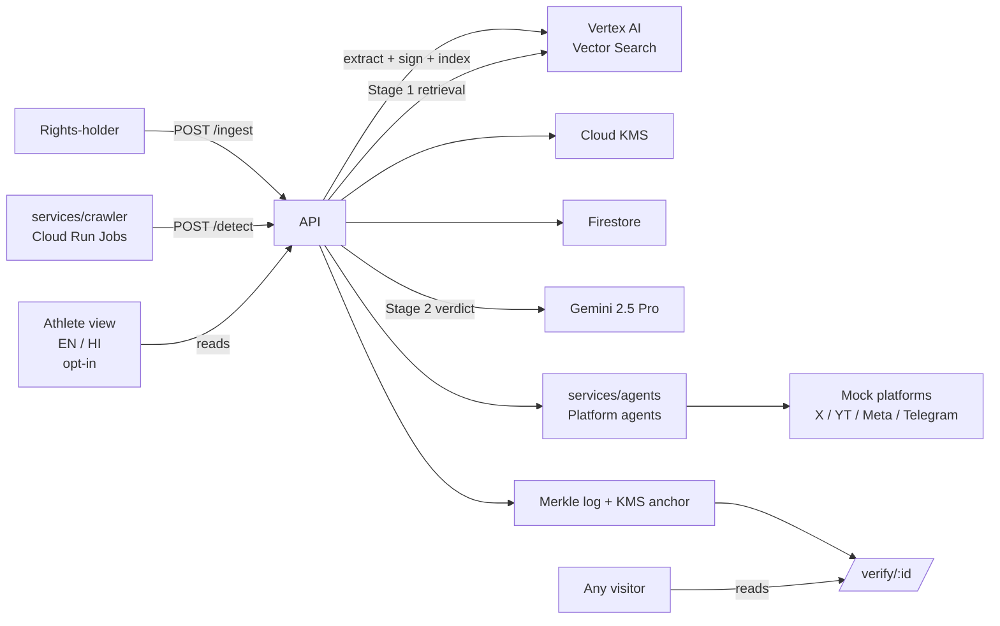

# Aegis Architecture

A single diagram, a table of services, and a walk-through of the flagship scenario.

## High-level view (ASCII)

```
                                     ┌───────────────────────────────┐
                                     │  Rights-holder dashboard       │ Firebase Auth (rh-only)
                                     │  (/rights-holder/*)            │
                                     └───────────────┬───────────────┘
                                                     │
  ┌─────────────────┐   POST /ingest                ▼                  ┌───────────────────────────┐
  │ Rights-holder   ├─►  ┌────────────────────┐                         │ Vertex AI                  │
  │ uploads clip    │    │ backend/ingest.py  │── frame+phash+embed ──►│  Multimodal Embeddings     │
  └─────────────────┘    │                    │                         │  (multimodal-embedding-001)│
                         │ C2PA sign via      │                         │                            │
                         │ c2patool + KMS     │                         │  Vector Search             │
                         └─────────┬──────────┘                         │  (ScaNN backed)            │
                                   │                                     └─────────────┬──────────────┘
                                   ▼                                                  │
                         ┌────────────────────┐          query top-k                   │
                         │ Firestore          │ ◄──────────────────────────────────── │
                         │ - clips            │                                        │
                         │ - candidates       │                                        │
                         │ - verdicts         │                                        │
                         │ - takedowns        │                                        │
                         │ - athletes         │                                        │
                         │ - receipts         │                                        │
                         └─────────┬──────────┘                                        │
                                   │                                                   │
  ┌──────────────────┐             │                                                   │
  │ services/        │  POST /detect (candidate)                                       │
  │  crawler         ├────────────►│                                                   │
  │  (Cloud Run Jobs)│             ▼                                                   │
  │  robots.txt,     │   ┌──────────────────────┐                                      │
  │  public URLs     │   │ backend/detect.py    │── Stage-1: pHash + Vector Search ───┘
  └──────────────────┘   │                      │── Stage-2: Gemini verdict.txt
                         │                      │── if deepfake: deepfake_verdict.txt
                         └─────────┬────────────┘
                                   │
                                   ▼
                         ┌──────────────────────┐
                         │ services/agents/     │
                         │  x_agent             │── MOCK_X_ENDPOINT      (DMCA §512(c))
                         │  youtube_agent       │── MOCK_YOUTUBE_ENDPOINT (DMCA §512(c))
                         │  meta_agent          │── MOCK_META_ENDPOINT    (DMCA §512(c))
                         │  telegram_agent      │── MOCK_TELEGRAM_ENDPOINT (IT Rules 2021)
                         └─────────┬────────────┘
                                   │
                                   ▼
                         ┌──────────────────────┐   ┌────────────────────────┐
                         │ backend/provenance/  │──►│ Cloud KMS              │
                         │ merkle.py            │   │ (asymmetric sign)      │
                         │ daily tree + anchor  │   └────────────────────────┘
                         └─────────┬────────────┘
                                   ▼
                         ┌──────────────────────┐        GET /verify/{id}
                         │ Public /verify page  │◄────────────────────────────
                         │ (Merkle receipt)     │
                         └──────────────────────┘

                              (default, unauthenticated)
                         ┌──────────────────────────────────┐
                         │ Athlete-facing view  /           │  ◄── default landing
                         │  bilingual EN / HI               │
                         │  opt-in enrolment                │
                         └──────────────────────────────────┘
```

## Services

| Service | Runtime | What it does |
|---|---|---|
| `backend/` (API) | Cloud Run | FastAPI app: `/ingest` `/detect` `/takedown` `/athlete/enroll` `/verify/{id}` `/provenance/anchor` `/healthz` |
| `services/crawler/` | Cloud Run Jobs | Public-URL crawler (robots.txt-aware); posts candidates to `/detect` |
| `services/agents/` | **In-process Python modules (Phase-1 fallback).** Not Google ADK. The `PlatformAgent` interface is the drop-in surface for an ADK migration in Phase 2. | Per-platform takedown logic (X, YouTube, Meta, Telegram) |
| `services/mock_platforms/` | Cloud Run | 4 honeypot endpoints returning structured takedown receipts |
| `backend/provenance/` | In-process + daily job | Merkle log + Cloud KMS anchor + `/verify` surface |
| `frontend/` | Firebase Hosting | React + Vite · EN + HI · Athlete view default, Rights-holder behind auth, public `/verify` |

## Flagship scenario — service trace

The integration test `tests/test_end_to_end.py` and the driver `demo/seed_demo.py` both walk this trace. Shown as a line-by-line flow of the flagship demo from `docs/case-study.md`:

```
publish:       POST /ingest (original)
               └─ ingest.extract_keyframes → compute_phashes → compute_embeddings
               └─ ingest.sign_c2pa_manifest (c2patool / Cloud KMS)
               └─ vector_index.upsert_clip
               └─ store.put_clip
               └─ provenance.merkle → anchor leaf for clip
               ◄ {clip_id}

leak seeded:   (external) manipulated clip placed on aegis-test-domain.example

crawl:         services/crawler/crawler.py run
               └─ fetch URL (robots.txt-aware, public only)
               └─ POST /detect (candidate)

detect:        POST /detect
               └─ detect.fingerprint_candidate (phashes + embeddings)
               └─ detect.stage1_retrieve → vector_index.query_top_k
               └─ detect.stage2_verdict → Gemini 2.5 Pro w/ prompts/verdict.txt
                  └─ if ambiguous synthetic: prompts/deepfake_verdict.txt
               └─ store.put_verdict
               └─ provenance.merkle → anchor leaf for verdict
               ◄ {verdict, confidence, recommended_action, athlete_alert}

alert:         frontend reads /verify/{id} from the athlete-facing view
               (bilingual EN/HI; AthleteView.tsx)

takedown:      POST /takedown
               └─ services.agents.get(platform) → PlatformAgent
                  └─ pick_jurisdiction (host_country || platform default)
                  └─ Gemini fill of prompts/takedown_{us,in}.txt
               └─ takedown.file_notice → POST mock platform endpoint
               └─ store.put_takedown
               └─ provenance.merkle → anchor leaf for notice
               ◄ {notice + ticket_id}

verify:        GET /verify/{detection_id}
               ◄ {verdict, confidence, merkle_receipt{root, kms_key_version, signature}}
```

## Mermaid (for the deck slide)



## Data flow summary

| Entity | Where it's authored | Where it lives | Lifetime |
|---|---|---|---|
| `Clip` | `/ingest` | Firestore `clips/` + Vector Search + Cloud Storage (manifest) | persistent |
| `Candidate` | `/detect` (via crawler) | Firestore `candidates/` + tmp Cloud Storage | persistent meta, tmp blob |
| `VerdictRecord` | `/detect` Stage 2 | Firestore `verdicts/` | persistent |
| `TakedownNotice` | `/takedown` | Firestore `takedowns/` | persistent |
| `AthleteEnrollment` | `/athlete/enroll` | Firestore `athletes/` | persistent; revocable |
| `MerkleReceipt` | `provenance.anchor_batch` | Firestore `receipts/` + exposed at `/verify/{id}` | persistent |

## Environment matrix

| Layer | LOCAL (dev / tests) | GCP (submission) |
|---|---|---|
| `AEGIS_INDEX_MODE` | `LOCAL` (in-memory FAISS-style) | `GCP` (Vertex Vector Search) |
| `AEGIS_STORAGE_MODE` | `LOCAL` (in-memory) | `GCP` (Firestore) |
| `AEGIS_KMS_MODE` | `LOCAL` (HMAC with dev key) | `GCP` (Cloud KMS asymmetric sign) |
| Gemini | deterministic mock in `_mock_verdict` | Vertex AI Gemini 2.5 Pro |
| C2PA signing | unsigned manifest fallback | `c2patool` + Cloud KMS |
| Platform submission | mock endpoints via `MOCK_*_ENDPOINT` | same mock endpoints (Cloud Run honeypots) |

The LOCAL → GCP path is flipped via env vars; no code changes. Mock paths are marked `_mock_*` or checked with `if os.environ.get(...)` everywhere so there is no ambiguity about what's real at runtime.

## Multi-agent orchestration — what we shipped vs. what the plan described

The approved plan described a "Google ADK multi-agent takedown pipeline." In Phase 1 we shipped **fallback #2** from the ranked-fallback ladder: a single-process Python agent registry (`services/agents/`) that exposes the same per-platform interface (`PlatformAgent.pick_jurisdiction`, `.host_provider()`, `.designated_agent_email()`, `.rule_basis_for()`, `.resolve_submit_endpoint()`). The interface is the drop-in surface for an ADK migration; the orchestration layer is the only piece that changes. This is honest in the pitch: "per-platform agents, single-process today, ADK in Phase 2."

## Ranked fallbacks (from the approved plan)

1. C2PA Python bindings flaky → `c2patool` subprocess (already the default).
2. ADK multi-agent orchestration blocked → single in-process agent registry (already in place — `services/agents/` is the upgrade path).
3. Deepfake fine-tune underperforms → zero-shot Gemini classification (Phase-1 default; fine-tune is Phase-2).
4. Vertex Search latency bad at 100K → cap at 25K for Finale; publish the cap.
5. Crawler breadth insufficient → narrow to 3 platform domains in demo; roadmap slide acknowledges.
6. `/verify` + Merkle anchor at Phase-1 → last-resort cut. Do not take.

Never cut: Athlete Hindi view · DRM-preempt artifacts · Published benchmark numbers · Ethics documentation.
